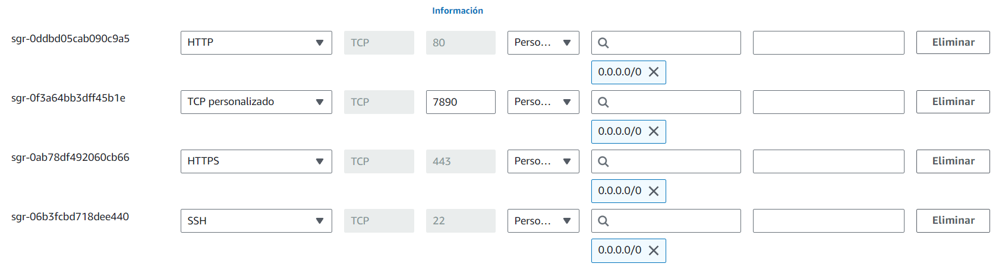

# Práctica-DAW-1.1
Documentación de como desplegar toda la pila LAMP

## Indice
1. [Creación de la instancia en AWS](#create-inst)
    1. [Iniciar laboratorio](#inicio-lab)
    2. [Panel de consola de AWS](#panel_cons)
    3. [Crear nueva instancia](#add-inst)
    4. [Modificar instancia](#mod-inst)
        * [Asignar IP elástica](#elast-ip)
        * [Modificación del grupo de seguridad](#mod-secure)
2. [Instalación de la pila LAMP ](#install_lamp)
3. [Instalación de herramientas para la pila LAMP](#install_tools)
    1. [PHPMyAdmin](#PHPMyAdmin)
    2. [Adminer](#Adminer)
    3. [Crear una base de datos y asociar un usuario](#new-db)
    4. [Goaccess](#goaccess)
    5. [Control de acceso básico](#aces-bs)
    6. [Control de acceso mediante .htaccess](#htaccess)


<div id='create-inst' />

## Creación de la instancia en AWS

<div id='inicio-lab' />

### Iniciar laboratorio
Para esto debemos de entrar en AWS Academy y __lanzar un laboratorio de Aprendizaje__, este se encuentra en ``Asignaturas > Contenido > lanzar un laboratorio de Aprendizaje``; hay encontraremos la siguiente interfaz donde crearemos la clave privada para la estancia que crearemos próximamente e iniciaremos el laboratorio de aprendizaje.


En la imagen anterior podemos ver en el apartado de __AWS Details__ que nos muestra la posibilidad de __descargar la clave PEM__, le pulsamos y le cambiamos el nombre por ``vokey.pem``, una vez hecho esto.

Una vez hecho esto le damos a __Start Lab__ y nos aparecerá a la derecha __AWS junto a un punto verde__(esto puede tardar unos segundos en cambiar de rojo a verde) y le pulsamos a este.

<div id='panel_cons' />

### Panel de consola de AWS

A continuación nos __redirigirá al panel de la consola de AWS__, en el buscador de esta __buscamos EC2__ y seleccionamos el que aparece en la imagen de abajo


Encontraremos gran cantidad de información sobre las instancias, pero nosotros nos centraremos en la creación de una nueva, para esto seleccionaremos el botón que inicia __Lanzar la instancia__


<div id='add-inst' />

### Crear nueva instancia

En esta nos pedirá como queremos hacer nuestra instancia y nos pedirá varios aspectos de esta, nosotros seleccionaremos los siguientes apartados:

1. __Imagen__ ``Ubuntu``
2. __Tipo de instancia__ ``t2.small``
3. __Par de claves__ ``vokey`` (Esta es la clave que hemos descargado al inicio)
4. __Configuraciones de red__ seleccionaremos la creación de un nuevo grupo de seguridad con los siguientes apartados seleccionados


Una vez hecho esto seleccionaremos el botón de lanzar instancia

<div id='mod-inst' />

## Modificar instancia

<div id='elast-ip' />

### Asignar IP elástica

Para la asignación de esta debemos de ir a ``Red y seguridad > Direcciones de IP elástica``


Aquí seleccionaremos el botón __Asignar dirección IP elástica__ y le daremos a __asignar__, posteriormente volveremos al panel con una IP que se nos abra creado.

Seleccionamos esta IP y en el apartado de ``acción > Asociar la dirección IP elástica``, buscamos nuestra instancia y le damos a __asignar__, de esta forma habremos logrado asignar una IP fija a nuestra instancia anteriormente creada


<div id='mod-secure' />

### Modificación del grupo de seguridad

Debemos de editar el grupo de seguridad de este para no tener futuros problemas en nuestra práctica, para esto iremos al apartado de ``Red de Seguridad > Security Groups`` y aquí __seleccionaremos al grupo de seguridad que creamos anteriormente__ para nuestra instancia y aquí seleccionaremos __editar reglas de entrada__, se nos abrirá un panel con los puertos que hemos abierto y deberemos de tener los siguientes:

* __HTTP__ - Puerto __80__ - __0.0.0.0/0__
* __HTTPS__ - Puerto __403__ - __0.0.0.0/0__
* __SSH__ - Puerto __22__ - __0.0.0.0/0__
* __PUERTO PARA GOACCESS__ - Puerto __80__ - __0.0.0.0/0__

Una vez añadidos guardaremos los cambios



Con esto ya hemos terminado la configuración de nuestra instancia

<div id='install_lamp' />

# Instalación de la pila LAMP  

Para esta crearemos el archivo ``install_lamp.sh`` en el __archivo script__

Lo primero que haremos es actualizar la lista de paquetes, actualizar los paquetes que tenemos
``` bash
#!/bin/bash

set -ex
# Actualiza la lista de paquetes
apt update

```
En segundo lugar, comenzaremos la instalación de apache que se realiza con los siguientes comandos

``` bash
# Actualizamos paquetes de sistema operativo
apt upgrade -y # -y respuesta yes

apt install apache2 -y
```
A continuación creamos un archivo en la carpeta ``conf > 000-default.conf`` y este archivo contendrá lo siguiente:

``` conf
<VirtualHost *:80>
    #ServerName www.example.com
    ServerAdmin webmaster@localhost
    DocumentRoot /var/www/html/

    DirectoryIndex index.php index.html

    ErrorLog ${APACHE_LOG_DIR}/error.log
    CustomLog ${APACHE_LOG_DIR}/access.log combined
</VirtualHost>
```

A continuación copiamos el archivo y lo lo llevamos a la ruta necesaria con el siguiente comando ``cp ../conf/000-default.conf /etc/apache2/sites-available``


Continuamos instalando php, habilitamos rewite y reiniciamos apache para que los cambios se actualicen
``` bash
sudo apt install php libapache2-mod-php php-mysql -y

# Habitamos el modelo rewite de apache
a2enmod rewrite

# Reiniciar apache
systemctl restart apache2
```

Creamos un archivo php en la siguiente ruta ``php > index.php`` y este tendrá el siguiente contenido

``` php
<?php

phpinfo()

?>
```
Copiamos este archivo a ``/var/www/html`` y cambiamos los permisos de esta carpeta

``` bash
# Copio el archivo php a el directorio donde esta los elementos de la web
cp ../php/index.php /var/www/html

# Modificar propietario de /var/www/html
chown -R www-data:www-data /var/www/html
```

Por ultimo instalamos MySQL con el siguiente comando ``apt install mysql-server -y``

<div id='install_tools' />

# Instalación de herramientas para la pila LAMP

Este comenzara de la misma forma que el anterior, se encontrara en ``script > install_tools.sh``
``` bash
#!/bin/bash

# x muestra los comandos que se realizan
# e en caso de fallar detiene la ejecucion
set -ex

source .env # Inportamos el contenido de variables de entorno

# Actualiza la lista de paquetes
apt update

# Actualizamos paquetes de sistema operativo
apt upgrade -y # -y respuesta yes
```
<div id='PHPMyAdmin' />

## PHPMyAdmin

En primer lugar configuraremos phpMyAdmin con los siguientes comandos, para esto en el archivo __.env__ (se encuentra en la carpeta __script__) pondremos la siguiente linea ``PHPMYADMIN_APP_PASSWORD=password`` siendo password la contraseña que nosotros queramos
``` bash
# Configuramos las respuestas para phpMyAdmin
echo "phpmyadmin phpmyadmin/reconfigure-webserver multiselect apache2" | debconf-set-selections
echo "phpmyadmin phpmyadmin/dbconfig-install boolean true" | debconf-set-selections
echo "phpmyadmin phpmyadmin/mysql/app-pass password $PHPMYADMIN_APP_PASSWORD" | debconf-set-selections
echo "phpmyadmin phpmyadmin/app-password-confirm password $PHPMYADMIN_APP_PASSWORD" | debconf-set-selections
```
Y continuares con la instalación de este
``` bash
# Instalamos phpMyAdmin
sudo apt install phpmyadmin php-mbstring php-zip php-gd php-json php-curl -y
```

<div id='Adminer' />

## Adminer

Comenzaremos con la creación de la carpeta en ``/var/www/html/adminer``, posteriormente lo descargaremos en esta carpeta y lo renombraremos
``` bash
# Crear dir para adminer
mkdir -p /var/www/html/adminer

# Descargo el archivo PHP de Adminer
wget https://github.com/vrana/adminer/releases/download/v4.8.1/adminer-4.8.1-mysql.php -P /var/www/html/adminer

# Renombramos el archivo
mv /var/www/html/adminer/adminer-4.8.1-mysql.php /var/www/html/adminer/index.php

```
<div id="new-db" />

## Creación de una base de datos

Para esto debemos de poner en el archivo ``.env`` el nombre de la base de datos de la siguiente forma ``DB_NAME=db_name`` y en el archivo ``install_tools.sh`` pondremos estos dos comandos
```bash
# Crear base de datos
mysql -u root <<< "DROP DATABASE IF EXISTS $DB_NAME"
mysql -u root <<< "CREATE DATABASE $DB_NAME"
```

Ademas crearemos un usuario para asociarlo en a la base de datos anteriormente creada, para esto modificaremos nuevamente el archivo ``.env`` añadiéndole estas dos variables 
``` conf
DB_PASSWORD=password
DB_NAME=db_name
```

En el archivo ``install_tools.sh`` añadiremos lo siguiente
``` bash
# Crear un usuario para la base de datos anterior
mysql -u root <<< "DROP USER IF EXISTS '$DB_USER'@'%'"
mysql -u root <<< "CREATE USER '$DB_USER'@'%' IDENTIFIED BY '$DB_PASSWORD'"
mysql -u root <<< "GRANT ALL PRIVILEGES ON $DB_NAME.* TO '$DB_USER'@'%'"
```
<div id="goaccess" />

## Goaccess

Para esto instalaremos goaccess y crearemos la carpeta status en la ruta ``/var/www/html/stats``
``` bash
#Install goaccess
sudo apt install goaccess -y

# Crear directorio de stadisticas
mkdir -p /var/www/html/stats # -p Si existe no ocure nada
```
una vez hecho esto generaremos un html que se ejecute a tiempo real en segundo plano, este nos dará las estadísticas de nuestra instancia

``` bash
# Goacess generate html in real time en segundo plano
goaccess /var/log/apache2/access.log -o /var/www/html/stats/index.html --log-format=COMBINED --real-time-html --daemonize
```
<div id="aces-bs" />

## Control de acceso básico

Para esto en primer lugar debemos de crear un archivo llamado ``000-default-stats.con`` en la ruta ``conf/000-default-stats.conf`` y este tendrá el siguiente contenido

``` conf
<VirtualHost *:80>
  #ServerName www.example.com
  ServerAdmin webmaster@localhost
  DocumentRoot /var/www/html

  <Directory "/var/www/html/stats">
    AllowOverride All
  </Directory>

  ErrorLog ${APACHE_LOG_DIR}/error.log
  CustomLog ${APACHE_LOG_DIR}/access.log combined
</VirtualHost>
```
 
Una vez creado el archivo anterior lo copiaremos en la ruta necesaria, deshabilitaremos el anterior y habilitaremos este, por ultimo debemos de reiniciar apache àra que los cambios se apliquen

``` bash
# copiar archivo de configuracion a apache
cp ../conf/000-default-stats.conf /etc/apache2/sites-available

# Desavilito 000-default
a2dissite 000-default.conf

# Habilito 000-default-stats.conf
a2ensite 000-default-stats.conf

# Reinicio apache
systemctl reload apache2
```

Para la creación de el archivo .htpasswd donde guardaremos el usuario y contraseña, en primer lugar añadiremos lo siguiente al ``.env``

```conf
STATS_USERNAME=user
STATS_PASSWORD=password
```

A continuación en el archivo ``install_tools.sh`` añadiremos la siguiente linea para la creación del archivo .htpasswd

``` bash
# Creamos el archivo .htpasswd
htpasswd -bc /etc/apache2/.htpasswd $STATS_USERNAME $STATS_PASSWORD
```
<div id="htaccess" />

## Control de acceso mediante .htaccess

Este es muy parecido al anterior, para esto en primer lugar debemos de crear un archivo llamado ``000-default-htaccess.con`` en la ruta ``conf/000-default-htaccess.conf`` y este tendrá el siguiente contenido

``` conf
<VirtualHost *:80>
  #ServerName www.example.com
  ServerAdmin webmaster@localhost
  DocumentRoot /var/www/html

  <Directory "/var/www/html/stats">
    AllowOverride All
  </Directory>

  ErrorLog ${APACHE_LOG_DIR}/error.log
  CustomLog ${APACHE_LOG_DIR}/access.log combined
</VirtualHost>
```

Una vez creado el archivo anterior lo copiaremos en la ruta necesaria, deshabilitaremos el anterior y habilitaremos este, por ultimo debemos de reiniciar apache àra que los cambios se apliquen

``` bash
# copiar archivo de configuracion a apache
cp ../conf/000-default-htaccess.conf /etc/apache2/sites-available

# Desavilito 000-default
a2dissite 000-default-stats.conf

# Habilito 000-default-htaccess.conf
a2ensite 000-default-htaccess.conf

# Reinicio apache
systemctl reload apache2
```
Creamos el archivo ``.htaccess`` en la ruta ``htaccess/.htaccess`` y este tendrá el siguiente contenido

``` bash
AuthType Basic
AuthName "Acceso restringido"
AuthBasicProvider file
AuthUserFile "/etc/apache2/.htpasswd"
Require valid-user
```

Por ultimo copiamos el archivo creado anteriormente y lo llevamos al directorio ``/var/www/html/stats``

``` bash
# Copiamos al archivo al directorio /var/www/html/stats
cp ../htaccess/.htaccess /var/www/html/stats
```