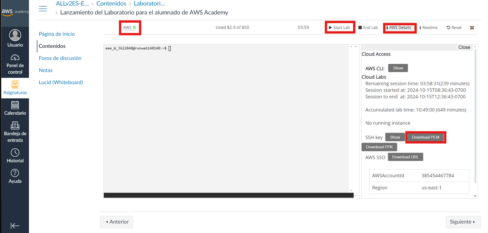
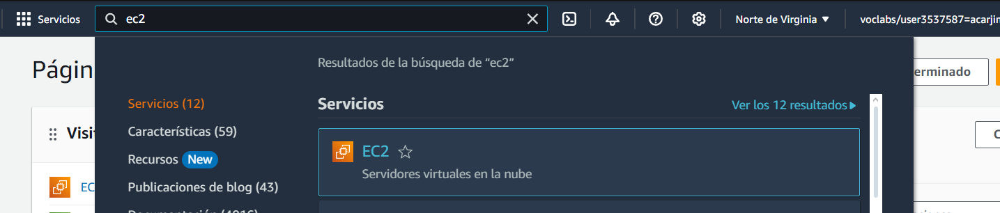
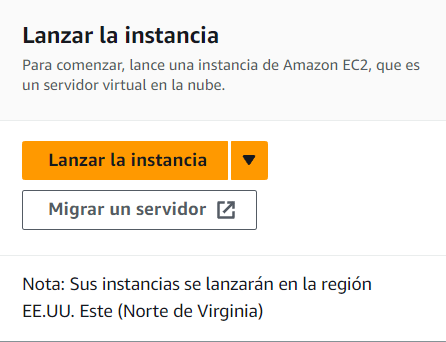
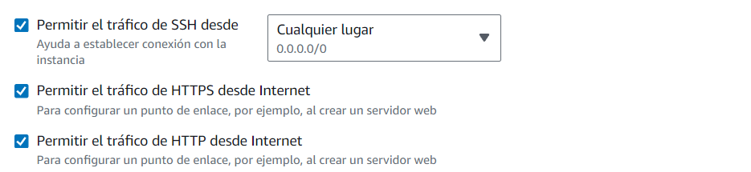
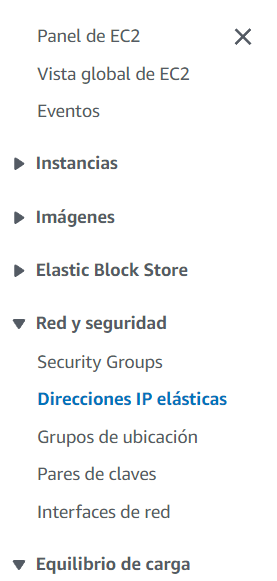
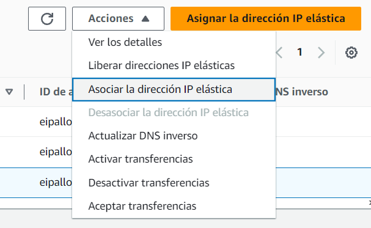

# Practica-daw-1.1
Documenentacion de como desplegar toda la pila LAMP

## Creacion de la istancia en AWS
### Iniciar laboratorio
Para esto devemos de entrar en AWS Academy y __lanzar un lavoratorio de Aperendizaje__, este se encunetra en ``Asignaturas > Contenido > lanzar un lavoratorio de Aperendizaje``; hay encontraremos la siguiente interfaz donde crearemos la clave privada para la estacia que crearemos proximanente y iniciaremos el laboratorio de aprendizaje.

En la imagen anterior podemos ver en el apartado de __AWS Details__ que nos muestra la posibilidad de __descargar la clave PEM__, le pulsamos y le combiamos el nombre por ``vokey.pem``, una vez hecho esto.

Una vez hecho esto le damos a __Start Lab__ y nos aparecera a la derecha __AWS junto a un punto verde__(esto puede tardar unos segundos en cambiar de rojo a verde) y le pulsamos a este.

### Panel de consola de AWS

A continuacion nos __rediriguira al panel de la consola de AWS__, en el buscador de esta __buscamos EC2__ y selecionamos el que aparece en la imagen de abajo

Encontraremos gran cantidad de informacion sobre las instancias, pero nosostros nos centraremos en la creacion de una nueva, para esto selecionaremos el boton que incia __Lanzar la instancia__

### Crear nueva instancia

En esta nos pedira como queremos hacer nuestra instacia y nos pedira varios aspectos de esta, nosostros seleccionaremos los siguientes apartados:

1. __Imagen__ ``ubuntu``
2. __Tipo de intancia__ ``t2.small``
3. __Par de claves__ ``vokey`` (Esta es la clave que ems dscargado al inicio)
4. __Configuraciones de red__ selecionaremos la creacion de un nuevo grupo de seguriadad con los siguientes apartados seleccionados

Una vez hecho esto seleccionaremos el boton de lanzar instancia

### Asignar ip elastica

Para la asignacion de esta debemos de ir a ``Red y seguridad > Direcciones de IP elastica``

Aqui seleccionaremos el boton __Asignar direccion IP elastica__ y le daremos a __asignar__, posteriormente volveremos al panel con una ip que se nos abra creado.

Seleccionamos esta IP y en el apartado de ``accion > Asociar la direcion IP elastica``, buscamos nuestra intancia y le damos a __asignar__, de esta forma abremos logrado asignar una ip fija a nuestra intancia anteriormente creada

